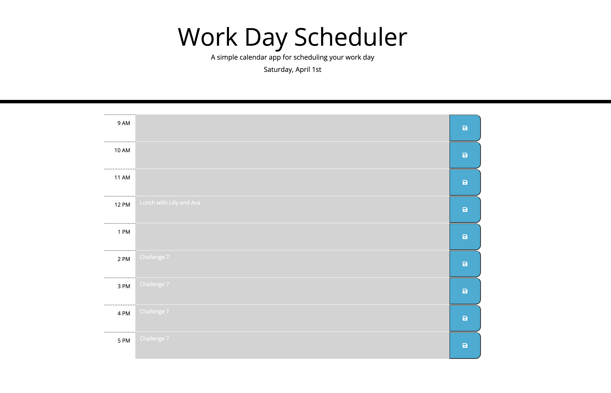

# Day-planner
Simple calendar application that allows a user to save events for each hour of the day.

- <!--What was your motivation?
Nowadays, people' day to day consist to switch from one taks to the following one
- <!--Why did you build this project? (Note: the answer is not "Because it was a homework assignment.")
This small planner, is just a little bit of help to be more organised, and make the best of the user's time.
- <!--What problem does it solve?
The planner will help the user to manage time effecively 

## Installation

This application run in the browser, so no installation needed.

## Usage

1. Current day is displayed on the screen.
2. The hours during the day are displayed on a table with time blocks.
3. The row colours indicate if the selected time slot is in the past, present, or future.
4. An evenet can be added clicking on the selected time.
5. Clicking the save icon, the event will be saven in the local storage.

    

## Credits

- Karla Fuentes Guerrero: https://github.com/KarlaFuGue
- Design: https://getbootstrap.com/docs/4.6/getting-started/introduction/

## License

MIT License

Copyright (c) [2023] [KarlaFuentesGuerrero]

Permission is hereby granted, free of charge, to any person obtaining a copy
of this software and associated documentation files (the "Software"), to deal
in the Software without restriction, including without limitation the rights
to use, copy, modify, merge, publish, distribute, sublicense, and/or sell
copies of the Software, and to permit persons to whom the Software is
furnished to do so, subject to the following conditions:

The above copyright notice and this permission notice shall be included in all
copies or substantial portions of the Software.

THE SOFTWARE IS PROVIDED "AS IS", WITHOUT WARRANTY OF ANY KIND, EXPRESS OR
IMPLIED, INCLUDING BUT NOT LIMITED TO THE WARRANTIES OF MERCHANTABILITY,
FITNESS FOR A PARTICULAR PURPOSE AND NONINFRINGEMENT. IN NO EVENT SHALL THE
AUTHORS OR COPYRIGHT HOLDERS BE LIABLE FOR ANY CLAIM, DAMAGES OR OTHER
LIABILITY, WHETHER IN AN ACTION OF CONTRACT, TORT OR OTHERWISE, ARISING FROM,
OUT OF OR IN CONNECTION WITH THE SOFTWARE OR THE USE OR OTHER DEALINGS IN THE
SOFTWARE.

## Languages

[def]: README-IMAGE.png